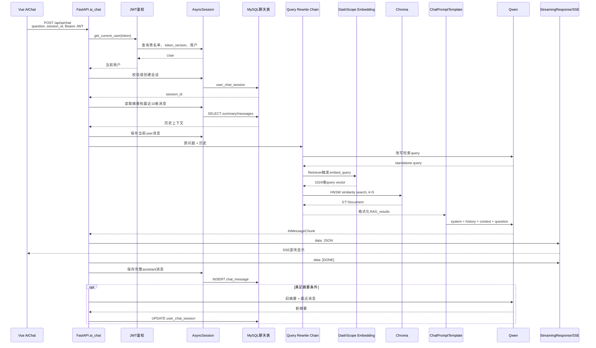

# LangChain + RAG 完整流程

> 状态说明：本文是 2026-08-07 工程优化前的只读审计快照。当前 Retriever 已增加配置化 Top-K、relevance score 阈值、来源和超时治理，详见 `docs/today_optimization_report.md`。

## 1. 总体结构

当前项目包含离线入库和在线问答两条链。

```text
离线：MySQL news
→ 新闻文本组装
→ 文本切块
→ Document
→ DashScope Embedding
→ Chroma

在线：用户问题
→ 会话历史和摘要
→ LLM改写检索query
→ Query Embedding
→ Chroma Top-K
→ 格式化context
→ ChatPromptTemplate
→ Qwen生成
→ SSE返回
→ 保存聊天消息
```

证据标签：

- 【代码已确认】：当前仓库或当前环境可直接证明。
- 【合理推断】：根据当前安装框架的行为推断。
- 【暂时无法确认】：缺少外部服务调用或评测证据。

## 2. 离线入库流程

入口是 `services/RAG_chroma/add_to_chroma.py:224-240`。

### 2.1 加载配置

`config/chroma_conf.py:load_config_from_env`，L23-L51，读取：

- `CHROMA_COLLECTION_NAME`，当前默认 `news_rag`。
- `CHROMA_PERSIST_DIR`，当前为 `backend/chroma_db` 绝对路径。
- `CHROMA_CHUNK_SIZE`，当前运行值 500。
- `CHROMA_CHUNK_OVERLAP`，当前运行值 100。
- 数据库读取批量和 Chroma 写入批量，当前均为 5。

【代码已确认】`IngestConfig` 类字段默认值是 800/120，而 `load_config_from_env` 的环境变量 fallback 是 500/100。脚本入口和 Retriever 均调用后者，因此当前主流程使用 500/100。

### 2.2 从 MySQL 读取新闻

`services/RAG_chroma/add_to_chroma.py:_fetch_news_batch`，L136-L139：

```text
select(News)
→ order_by(News.id.asc())
→ offset + limit
→ Sequence[News]
```

项目没有使用 LangChain 通用 Document Loader。数据库读取由 SQLAlchemy `AsyncSession` 完成，随后由项目代码手工创建 LangChain `Document`。

### 2.3 组装新闻文本

`services/RAG_chroma/add_to_chroma.py:_compose_news_text`，L93-L103，将字段整理为：

```text
标题: ...
摘要: ...
作者: ...
正文:
...
```

### 2.4 文本切块

`services/RAG_chroma/add_to_chroma.py:_build_text_splitter`，L82-L90，创建 `RecursiveCharacterTextSplitter`：

```python
chunk_size=500
chunk_overlap=100
separators=["\n\n", "\n", "。", "！", "？", "；", "，", " ", ""]
```

`length_function` 没有显式配置，当前已安装 LangChain 默认使用 Python `len`，所以 500 的单位是 Python 字符长度，不是模型 token。

### 2.5 构建 Document

`services/RAG_chroma/add_to_chroma.py:_build_documents_for_news`，L106-L133：

- `page_content`：当前 chunk 文本。
- `id`：`news-{news_id}-chunk-{index}`。
- metadata：`news_id`、`chunk_index`、`chunk_total`、`title`、`category_id`、`author`、`publish_time`、`source`。

【代码已确认】当前 Chroma 中有 403 个 Document、403 个唯一 `news_id`，所有 `chunk_total` 均为 1。因此目前每篇新闻都没有实际切出第二块，但 `k` 的语义仍然是文本块数量。

### 2.6 生成文档向量并写入 Chroma

Embedding 初始化在 `services/RAG_chroma/add_to_chroma.py:_build_embedding_model`，L52-L61：

```text
类：langchain_community.embeddings.DashScopeEmbeddings
模型：text-embedding-v3
API key：Settings.dashscope_key
max_retries：3
```

项目触发方法是 `Chroma.add_documents`，`services/RAG_chroma/add_to_chroma.py:159`。其内部调用 `DashScopeEmbeddings.embed_documents(texts)`，再由 DashScope SDK 请求远程 Embedding 服务。

写入前执行 `vector_store.delete(where={"news_id": news.id})`，L203-L204，因此相同新闻重新入库时会先删除旧块。

## 3. 在线问答流程

下面以用户输入“中国科技成就有哪些”为例。

### 3.1 前端请求

入口：`../frontend/src/views/AIChat.vue:sendMessage`，L148-L178；`fetchAIResponse`，L180-L275。

```http
POST http://127.0.0.1:8000/api/ai/chat
Content-Type: application/json
Authorization: Bearer <access-token>
```

```json
{
  "messages": [
    {"role": "user", "content": "中国科技成就有哪些"}
  ],
  "stream": true,
  "session_id": null
}
```

普通接口使用 Axios，AI 流式接口使用原生 Fetch，以便读取 `response.body`。

### 3.2 FastAPI、鉴权和数据库依赖

入口：`routers/ai_chat.py:ai_chat`，L94-L269。

1. `schemas.ai_chat.AIChatRequest` 校验 body。
2. `utils.auth.get_current_user` 读取 Authorization。
3. `crud.users.get_user_by_token` 校验 JWT、黑名单和 token version。
4. `config.db_conf.get_db` 提供 AsyncSession。
5. 有 `session_id` 时按用户和会话 ID 查询；没有时创建会话。

【代码已确认】`get_current_user` 和路由都声明了 `get_db`，但 FastAPI 默认缓存相同 dependency，因此单个请求共享同一个 Session。

### 3.3 提取当前问题

`utils/create_prompt.py:extract_latest_user_query`，L33-L47，从请求 `messages` 倒序查找最后一条非空 user 消息。

前端只发送本轮用户消息；历史消息由后端从数据库读取，不依赖前端回传。

### 3.4 读取会话记忆

`routers/ai_chat.py:129-140`：

- 读取 `UserChatSession.summary`。
- 读取最近 10 条 `ChatMessage`。
- `build_langchain_summary_history` 将摘要转为 `SystemMessage`，历史转为 `HumanMessage/AIMessage`。

历史查询是倒序，构建 Prompt 时重新反转为正序。

### 3.5 Query Rewrite

`services/get_retrievel.py:get_retrievel_chain`，L11-L26：

```text
retrievel_rag_sysytem.txt
+ MessagesPlaceholder(recent_messages)
+ 当前用户问题：{query}
→ get_chat_model()
→ StrOutputParser()
```

原始问题不会直接传给 Retriever。LCEL 挂载位置为 `routers/ai_chat.py:153-161`：

```text
current_question
→ {query, recent_messages}
→ retrieval_query_chain
→ 改写后的字符串
→ retriever
```

【暂时无法确认】“中国科技成就有哪些”在某次请求中会被精确改写成什么。改写由远程模型生成，当前 temperature 是依赖默认 0.7，本次文档任务没有调用模型。

### 3.6 Query Embedding

初始化：`services/retriever_factory.py:23-26`。

实际执行链：

```text
LCEL执行Retriever
→ VectorStoreRetriever._aget_relevant_documents
→ Chroma.asimilarity_search
→ Chroma.similarity_search
→ Chroma.similarity_search_with_score
→ DashScopeEmbeddings.embed_query(rewritten_query)
→ DashScope text-embedding-v3
→ query vector
```

项目代码没有显式调用 `embed_query`，但在 `routers/ai_chat.py:161` 将 Retriever 作为 Runnable 后，由 LangChain/Chroma 内部触发。

【代码已确认】当前已存文档向量维度为 1024。

【暂时无法确认】本次 query 的远程返回维度没有单独调用验证；正常检索要求它与索引的 1024 维一致。

### 3.7 Chroma Top-5

`services/retriever_factory.py:28-36`：

```python
vector_store = Chroma(
    collection_name="news_rag",
    persist_directory=".../backend/chroma_db",
    embedding_function=embeddings,
)

vector_store.as_retriever(search_kwargs={"k": 5})
```

- 默认 `search_type`：`similarity`。
- `score_threshold`：未设置。
- metadata filter：未设置。
- MMR：未使用。
- reranker：未使用。
- `k=5`：五个 Document/chunk，不是固定五篇新闻。

当前每篇新闻仅一个 chunk，因此现有数据状态下通常相当于五篇新闻。

### 3.8 当前真实距离度量

必须区分源码意图和当前持久化索引。

#### 源码意图

`services/RAG_chroma/add_to_chroma.py:_build_vector_store`，L73-L78：

```python
collection_metadata={"hnsw:space": "cosine"}
```

#### 当前运行事实

- 当前 `news_rag.metadata` 是 `None`。
- `chroma.sqlite3` 的 collection schema 明确记录 `space: "l2"`。
- 当前安装 `chromadb==1.5.9`，未指定 metadata 时默认 L2。
- 使用已有向量进行只读查询，返回 distance `0.0、0.6039、0.6514`。

结论：

- 距离由 Chroma 计算，不是项目代码计算。
- 当前实际是 L2 squared distance，不是 cosine。
- 项目没有读取、返回或转换距离分数。

当前 L2 公式：

```text
d(x, y) = ||x-y||² = Σ(x_i-y_i)²
```

值越小越相似，完全相同为 0。

供面试理解，余弦相似度公式是：

```text
cos(x,y) = (x·y) / (||x|| ||y||)
cosine distance = 1 - cos(x,y)
```

【合理推断】集合可能在加入 cosine 参数前已经创建，而重新打开已有集合不会改变原索引度量；仓库无法证明具体历史原因。

### 3.9 格式化 RAG context

`routers/ai_chat.py:_format_rag_docs`，L76-L88：

```text
【标题】metadata.title
【发布时间】metadata.publish_time
【内容】page_content
```

五个 Document 之间用两个换行分隔。如果 Retriever 返回空列表，函数返回空字符串。

### 3.10 最终 Prompt

模板来源：

- `config/system_prompt.txt:1-9`：Qxia 身份、仅依据 RAG、无资料时兜底、列引用标题。
- `config/user_prompt.txt:1-2`：`用户问：{query}`。

`routers/ai_chat.py:146-162` 构建：

```text
SystemMessage(system_prompt，已渲染RAG_results)
→ MessagesPlaceholder(summary + recent messages)
→ HumanMessage(user_prompt，已渲染query)
→ ChatModel
```

`{RAG_results}` 当前挂载关系是正确的：Retriever → `_format_rag_docs` → Runnable 字典 → `ChatPromptTemplate`。

### 3.11 ChatModel

`services/model_factory.py:get_chat_model`，L20-L32：

- 类：`langchain_community.chat_models.ChatOpenAI`。
- Provider：DashScope OpenAI 兼容接口。
- 模型：`qwen3.6-flash`。
- `streaming=True`。
- 当前依赖默认：`temperature=0.7`、`max_tokens=None`、`request_timeout=None`、`max_retries=2`。

【代码已确认】项目没有显式设置主 LLM timeout、temperature 或 max_tokens。

### 3.12 SSE 返回与消息保存

`routers/ai_chat.py:178-225`：

```text
generation_chain.astream(current_question)
→ chunk.content
→ data: {choices:[{delta:{content}}]}\n\n
→ data: [DONE]\n\n
```

前端 `../frontend/src/views/AIChat.vue:218-261` 使用 `ReadableStreamDefaultReader` 和 `TextDecoder` 解析。

保存顺序：

1. 模型调用前保存并 commit 用户消息，`routers/ai_chat.py:168-176`。
2. SSE 模型流结束。
3. 先发送 `[DONE]`。
4. 拼接完整 assistant 文本并保存，L208-L219。
5. 符合条件时更新会话摘要。

风险：

- 模型失败或客户端断连时可能只保存用户消息。
- assistant 保存失败可能发生在答案已显示之后。
- `MAX(message_index)+1` 没有锁或组合唯一约束。
- AsyncSession 保持到流结束，长流会长期占用连接池连接。
- 主模型没有显式 timeout。
- 前端没有 AbortController，后端没有 heartbeat 或主动断连检测。

## 4. 时序图



## 5. 当前无法确认

- 【暂时无法确认】特定问题每次的 query rewrite 精确文本。
- 【暂时无法确认】当前新闻数据的 Recall@5、context precision 和答案忠实度，因为没有标注测试集。
- 【暂时无法确认】生产代理是否会缓存或缓冲 SSE。
- 【暂时无法确认】源码 cosine 与当前 L2 索引不一致的具体历史形成时间。
- 【暂时无法确认】DashScope 在 `max_tokens=None` 时采用的服务端输出上限。
