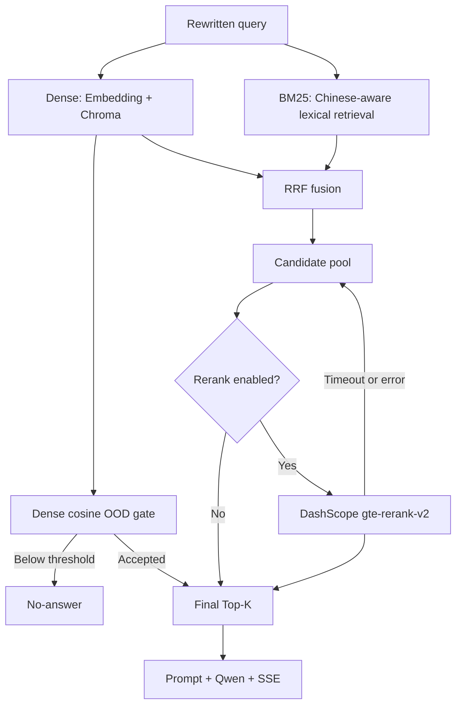

# RAG V2 设计说明

## 1. V1 与 V2

V1 只有一条 Dense 路径：

```text
Query -> DashScope Embedding -> Chroma cosine -> threshold -> Top-K -> Prompt -> Qwen
```

V2 在保留 V1 baseline 的基础上提供三种模式：



运行时配置支持：

- Dense：`RAG_RETRIEVAL_MODE=dense`，自动忽略 rerank 开关。
- Hybrid：`RAG_RETRIEVAL_MODE=hybrid`、`RAG_RERANK_ENABLED=false`。
- Hybrid + Rerank：`RAG_RETRIEVAL_MODE=hybrid`、`RAG_RERANK_ENABLED=true`。

## 2. Dense Retrieval

`services/retriever_factory.py:get_news_vector_store` 使用 `DashScopeEmbeddings(text-embedding-v3)` 和持久化 Chroma Collection。`retrieve_news` 调用 LangChain `asimilarity_search_with_relevance_scores`；该调用内部先把 query 转成向量，再让 Chroma 按 cosine 距离检索。

cosine similarity 关注向量方向：

```text
cosine(A, B) = (A · B) / (||A|| * ||B||)
```

当前 LangChain Chroma 包装把 cosine distance 转成 relevance score，数值越大越相关。`dense_ms` 包含 query embedding 与 Chroma search，因为项目调用的第三方 API 没有暴露稳定的阶段边界。

## 3. BM25 与中文分词

BM25 是稀疏词项检索，擅长型号、机构名、数字和原文关键词。核心公式为：

```text
score(D, Q) = sum IDF(q) * tf(q,D)*(k1+1)
              / (tf(q,D) + k1*(1-b+b*|D|/avgdl))
```

实现位于 `services/bm25_retriever.py`，默认 `k1=1.5`、`b=0.75`。它直接读取现有 Chroma chunk 与 metadata，不建立第二份新闻数据源。

中文不能依赖空格分词。本实现对文本做 Unicode NFKC 与小写归一化：

- 连续中文生成字符 bigram，例如“量子计算”得到“量子”“子计”“计算”。
- 英文、数字和型号保留为 token，例如 `GPT-4.5`、`C919`、`H100`。
- 标题 token 重复一次，提高短标题中的实体权重。

这种方案无新增依赖、无词典加载，适合 403 个 chunk 的学习项目。代价是不能理解真正的词法边界，未来扩大语料后需要用困难集重新评估。

## 4. RRF Fusion

Dense relevance 与 BM25 score 不在同一尺度，不能直接相加。Reciprocal Rank Fusion 只使用名次：

```text
RRF(d) = sum 1 / (k + rank_i(d))
```

项目默认 `k=60`。同一 chunk 若同时出现在 Dense 和 BM25 前列，会获得两路贡献。稳定身份由 `news-{news_id}-chunk-{chunk_index}` 构成。融合结果保留：

- `dense_rank`、`dense_score`
- `bm25_rank`、`bm25_score`
- `rrf_score`
- `pre_rerank_rank`

## 5. Reranker

`services/reranker.py` 使用现有 DashScope SDK 的 `TextReRank.call`，默认模型为 `gte-rerank-v2`。输入是 query 与融合候选的“标题 + 截断正文”，输出是 query-document 相关度和新顺序。

模型与接口能力以[阿里云百炼文本排序官方文档](https://help.aliyun.com/zh/model-studio/text-rerank-api)为准。

工程边界：

- 只精排前 `RAG_RERANK_CANDIDATE_K=10` 个候选。
- 单文档最多传 `RAG_RERANK_DOCUMENT_MAX_CHARS=2000` 字符。
- 使用 `asyncio.to_thread` 避免同步 SDK 阻塞事件循环。
- 使用独立 15 秒 timeout。
- 任意异常、超时或空结果都记录 `rag_rerank_failed`，并回退到 RRF 顺序。
- Dense 模式不会调用 reranker。

## 6. Threshold 与 OOD

V2 不混用三类分数：

| 分数 | 用途 | 是否用于 threshold |
| --- | --- | --- |
| Dense cosine relevance | 语义相关性与 OOD gate | 是 |
| BM25 score | 稀疏召回内部排序 | 否 |
| RRF score | 合并 Dense/BM25 名次 | 否 |
| Rerank score | 候选精排 | 否 |

所有 pipeline 先检查最高 Dense relevance 是否达到 `RAG_SCORE_THRESHOLD`。未达到时不把 BM25 或 rerank 结果送入 Prompt，而是走固定 no-answer。这样不会因 OOD 问题偶然命中普通词而被 BM25 强行接受。

## 7. Evaluation 指标

- Precision：返回结果中相关结果的比例，关注“返回得准不准”。
- Recall：所有相关结果中被召回的比例，关注“漏没漏”。
- Recall@K：前 K 个结果覆盖相关文档的程度。
- Hit@K：前 K 个结果只要包含任一相关文档即为 1。
- MRR：第一个相关结果名次倒数的平均值，Top-1 为 1，Top-2 为 0.5。
- OOD rejection accuracy：领域外问题最终未进入 RAG Prompt 的比例。
- P50/P95：50%/95% 请求在该延迟内完成。

当前每条正常样本只有一个相关新闻 ID，所以 Hit@K 和 Recall@K 相同。未来增加多个相关 chunk 标注后，两者才会表达不同信息。

## 8. Query Rewrite

`services/get_retrievel.py:needs_query_rewrite` 先做低风险规则判断：没有历史或不存在明确上下文指代时，直接保留用户原 query；出现“它”“这个”“刚才”“上述”等标记且有历史时，才调用 LLM 补全。

Rewrite Prompt 规定不得新增未出现的时间、地域、人物、事件或立场。它的职责是消解指代和省略，不是替用户改变问题。

## 9. 日志与性能口径

新增事件：

| 事件 | 关键字段 |
| --- | --- |
| `rag_dense_completed` | `candidate_count`、`duration_ms`、`includes_query_embedding` |
| `rag_bm25_completed` | `candidate_count`、`duration_ms` |
| `rag_fusion_completed` | `candidate_count`、`duration_ms`、`rrf_k` |
| `rag_rerank_started` | `input_count`、`model` |
| `rag_rerank_completed` | `output_count`、`duration_ms`、`success` |

最终 `rag_retrieval_completed` 记录 `retriever_init_ms`、`dense_ms`、`bm25_ms`、`fusion_ms`、`rerank_ms`、`retrieval_total_ms`，并为每个最终 chunk 记录全部 rank。`ai_chat_completed` 复用同一组耗时，不再把外层计时和内部检索计时混为一谈。

## 10. 配置参数

| 环境变量 | 默认值 | 作用 |
| --- | ---: | --- |
| `RAG_RETRIEVAL_MODE` | `dense` | `dense` 或 `hybrid` |
| `RAG_DENSE_CANDIDATE_K` | 20 | Dense 初召回数量 |
| `RAG_BM25_CANDIDATE_K` | 20 | BM25 初召回数量 |
| `RAG_RRF_K` | 60 | RRF 排名平滑常数 |
| `RAG_FINAL_TOP_K` | 5 | 最终送入 Prompt 的最大 chunk 数 |
| `RAG_BM25_K1` | 1.5 | BM25 TF 饱和参数 |
| `RAG_BM25_B` | 0.75 | BM25 文档长度归一化参数 |
| `RAG_RERANK_ENABLED` | `false` | 是否启用精排，仅 Hybrid 生效 |
| `RAG_RERANK_CANDIDATE_K` | 10 | 送入 reranker 的候选数 |
| `RAG_RERANK_MODEL` | `gte-rerank-v2` | DashScope rerank 模型 |
| `RAG_RERANK_TIMEOUT_SECONDS` | 15 | 精排超时 |
| `RAG_RERANK_DOCUMENT_MAX_CHARS` | 2000 | 单候选传入精排的字符上限 |
| `RAG_SCORE_THRESHOLD` | 0.5 | 最高 Dense score 的 query gate |

`RAG_TOP_K=5` 为 V1 `get_news_retriever()` 兼容配置；V2 主链使用 `RAG_FINAL_TOP_K`。

## 11. 修改文件地图

```text
config/settings.py
config/retrievel_rag_sysytem.txt
.env.example
services/bm25_retriever.py
services/reranker.py
services/retriever_factory.py
services/get_retrievel.py
routers/ai_chat.py
evaluation/evaluate_rag.py
evaluation/rag_cases.json
tests/test_rag_v2.py
docs/rag_v2_design.md
docs/rag_v2_evaluation_report.md
.gitignore
```

OOD 文件已有 20 条严格领域外问题，本轮复用，没有为了提高指标改写这些问题。正常集增加 4 条 GPT-4.5、SpaceX、5G-A、H100 专有名词问题。

## 12. Future Work

1. 增加困难同义表达、实体歧义、多相关文档和 chunk 级标注，避免 Dense Top-1 天花板效应。
2. 增加 Precision@K、nDCG、引用正确率与回答忠实度评测。
3. 在数据规模增大后测量 BM25 索引内存和重建耗时，再决定是否需要更专业的检索后端。
4. 设计显式 Collection 版本切换后清理 BM25/Chroma 进程缓存。
5. 独立、小范围迁移 deprecated LangChain 集成包，不能与业务升级混在一起。
6. 在足够数据证明 reranker 有收益后，再考虑默认启用、熔断和调用预算。
